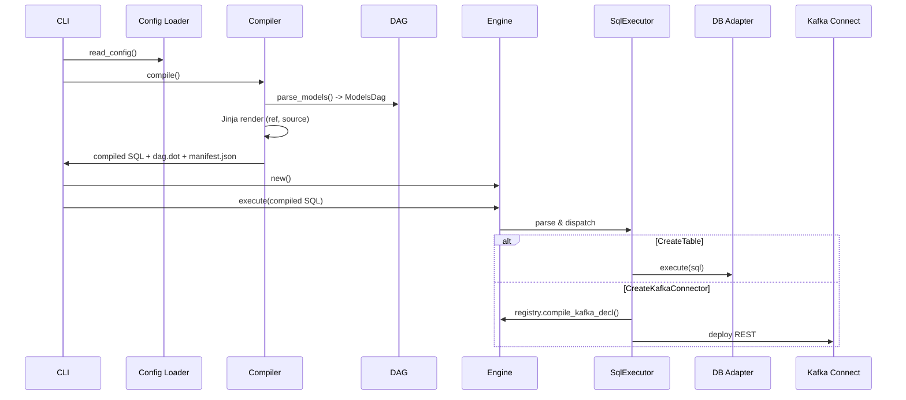

# Developer Guide — Execution Flow and Architecture

This guide explains the end‑to‑end flow from the CLI to compilation, DAG building, and execution. It’s a concise map of where things live and what is called when.

## Workspace Overview
- `crates/cli`: Binary `foundry` with subcommands `init`, `compile`, `run`.
- `crates/ff_core`: Config loading, SQL parsing/macros, DAG compilation, run orchestration.
- `crates/dag`: `ModelsDag` graph, ordering, selectors, DOT export.
- `crates/engine`: SQL/Kafka executors and an in‑memory registry/catalog.
- `crates/sqlparser`: SQL AST + custom extensions (CREATE MODEL, Kafka DSL).
- `crates/common`: Shared types (materializations, relations, nodes), utils.

## Project Layout (generated by `foundry init`)
- `foundry-project.yml`: Project config (models dir, layers, sources, compile path, profile).
- `connections.yml`: Connection profiles (adapter type, host, port, auth, db).
- `foundry_models/`: SQL models, usually layered (e.g., `bronze/`, `silver/`, `gold/`).
- `macros/`: User macros (future use; built‑ins live in code).
- `foundry_sources/warehouse/warehouse-sources.yml`: Database schemas + tables for `source()`.
- `foundry_sources/kafka/kafka-sources.yml`: Optional; used to resolve Kafka Connect host.
- `compiled/`: Output folder generated by `compile` (materialized SQL, `manifest.json`, `dag.dot`).

## Configuration Loading
- Entry: `ff_core::config::loader::read_config` reads:
  - `foundry-project.yml` → `FoundryProjectConfig` (models layers, sources, compile path, profile).
  - `connections.yml` → `AdapterConnectionDetails` (e.g., Postgres).
  - Warehouse sources (required) and Kafka sources (optional) → resolution for `source()` and Connect host.

## CLI Entry Points
- `crates/cli/src/main.rs` → `foundry` binary with subcommands:
  - `init` → `cli::commands::init::handle_init` scaffolds project folders and YAMLs.
  - `compile` → `cli::commands::compile::handle_compile` delegates to compiler (below).
  - `run` → `cli::commands::run::handle_run` loads config and calls `ff_core::functions::run`.

## Compile Flow (build DAG, render SQL, write artifacts)
- Entry: `ff_core::compiler::compile(compile_path)`
  1) Read project config with `read_config(None)`.
  2) Parse models by layer: `ff_core::parser::parse_models(layers)`
     - Scans `foundry_models/<layer>/**/*.sql`.
     - Extracts relations via regex: `{{ ref('model') }}` and `{{ source('schema','table') }}`.
     - Produces `ModelNode`s (schema, name, relations, path).
  3) Build DAG: `dag::ModelsDag::new(nodes)` validates acyclic graph.
  4) Create Jinja env: `ff_core::macros::build_jinja_env(dag, warehouse_sources)`
     - Provides `ref()` (resolves model -> `schema.table`) and `source()` (resolves from YAML).
  5) For each node, render SQL template, then prepend materialization with
     `build_materialized_sql(materialization, fq_relation, rendered_sql)`.
  6) Write outputs under `compiled/` preserving structure, plus:
     - `compiled/dag.dot` via `ModelsDag::export_dot_to`.
     - `compiled/manifest.json` with model metadata and dependencies.
  7) Returns `Arc<ModelsDag>` for subsequent run.

## Run Flow (select models, execute in order)
- Entry: `ff_core::functions::run(config, model_opt)`
  1) Re‑compile to get fresh DAG: `compiler::compile(config.project.compile_path.clone())`.
  2) Construct `Engine` (SQL/Kafka executor + memory catalog).
  3) Create DB adapter from selected profile: `database_adapters::create_db_adapter`.
  4) Derive `SourceConnArgs` (Kafka Connect host) from Kafka sources if configured.
  5) Select nodes based on `model_opt` with selector semantics:
     - `<model` upstream only; `model>` downstream only; `<model>` both; plain `model` single node; `None` all.
     - Uses `ModelsDag::{transitive_closure, get_model_execution_order, get_included_dag_nodes}`.
  6) For each selected node:
     - Read compiled SQL from `compiled/` using `common::utils::read_sql_file`.
     - Execute via `engine.execute(sql, &source_conn_args, Some(&mut db_adapter))`.

## Engine Execution
- `engine::Engine::execute` → `executor::Executor::execute`:
  - Parses SQL into AST via `sqlparser` (Generic dialect).
  - Dispatches to `executor::sql::SqlExecutor::execute`.
- `SqlExecutor::execute` handles AST statements:
  - `CreateKafkaConnector`: builds and deploys a Kafka Connect config
    - Connector declaration compiled via `registry.compile_kafka_decl(name)` which merges:
      - Base connector `WITH (...)` properties.
      - SMT pipeline configurations + optional `predicate` under `transforms.<pipe>_<smt>.*`.
    - Deployed through `executor::kafka::KafkaExecutor` to the Connect REST API using `SourceConnArgs`.
  - `CreateTable`: forwards statement string to `AsyncDatabaseAdapter::execute` (warehouse pushdown).
  - Other statements currently error (extend here for further DDL/DML support).

## Registry (Catalog)
- `engine::registry::MemoryCatalog` stores declared objects:
  - Transforms (SMTs), pipelines, connectors, models.
  - `Register` trait methods (e.g., `register_kafka_smt`, `register_smt_pipeline`, `register_kafka_connector`, `register_model`).
  - `Compile` trait: `compile_kafka_decl` assembles the effective Connect config from connectors + pipelines + transforms.

## Execution Sequence (Mermaid)

## Common Commands (dev loop)
- Build: `cargo build`
- Run all models: `cargo run -p foundry -- run`
- Run slice: `cargo run -p foundry -- run -m <model|<model|model>|<model>>`
- Compile only: `cargo run -p foundry -- compile`
- Scaffold: `cargo run -p foundry -- init -n my_proj -a medallion`
- Local services (optional): `docker compose -f development/docker-compose.yml up -d`

## Notes and Extension Points
- Add new statement support in `executor::sql::SqlExecutor::execute`.
- Extend registry for additional source kinds (API/JDBC) mirroring the Kafka pattern.
- Enhance parser/macros to support more Jinja helpers and materialization strategies.
- Persist catalog (swap MemoryCatalog for file/SQLite) to survive process restarts.

This document mirrors current behavior; if you change flows, update the relevant section (Compile Flow, Run Flow, or Engine Execution).
